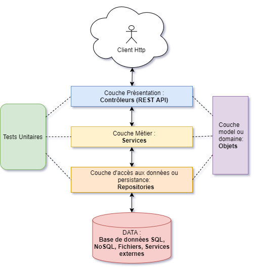
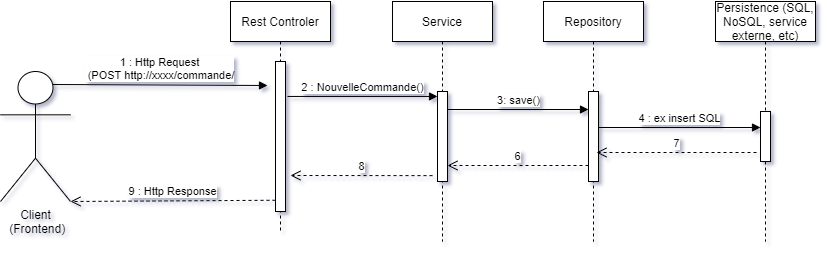
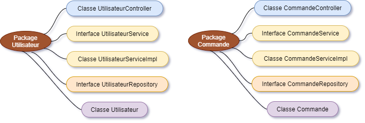

## [:house: Sommaire](../README.md)

# 10 - Architecture en couche

## :dart: Objectifs 

- Comprendre l'intérêt de cette organisation et l'adapter selon ses besoins
- Savoir définir les interfaces nécessaires
- Etre préparé à attaquer Spring sereinement

## :toolbox: Définitions et Concepts

### Généralités

L’architecture logicielle décrit d’une manière symbolique et schématique les différents éléments d’un ou de plusieurs systèmes informatiques, leurs interrelations et leurs interactions.Elle ne décrit pas ce que doit réaliser un système informatique mais plutôt comment il doit être conçu de manière à répondre aux spécifications.

Bien architecturer ses projets permet de réduire le temps de maintenance, facilite les évolution et augmente la qualité des logiciels.

L'architecture logicielle, tout comme l'architecture traditionnelle, peut se catégoriser en styles, styles finalement assez restreints. De plus, un système informatique peut utiliser plusieurs styles selon le niveau de granularité ou l'aspect du système décrit.

Pour débuter nous allons focaliser sur l'architecture en couche (Layered Architecture ou package by layer en Java). C'est une approche traditionnelle très largement utilisée qui vous permettra de commencer à organiser les différents composants backend de vos applications.

### Détails

- L'architecture en couche est une façon d'organiser les composants d'un système en groupant les fonctionnalités similaires pour simplifier la compréhension et la maintenance du système.
- La division en couches consiste alors à regrouper les composants possédant une grande cohésion (sémantiques semblables) de manière à créer un empilement de paquetages de composants ; tous les composants des couches supérieures dépendants fonctionnellement des composants des couches inférieures.
- Les couches sont généralement séparées par des interfaces bien définies pour éviter les conflits et les dépendances entre elles.
- L'architecture en couche est particulièrement importante lorsque l'on développe des applications complexes ou évoluantes qui doivent être entièrement compréhensibles, faciles à maintenir et à -évolutionner au fil du temps.

- Avec Java nous allons organiser les couches via les packages ex
  - co.simplon.app.api (pour les contrôleurs rest) 
  - co.simplon.app.service (pour les services d'application)
  - co.simplon.app.repository
  - co.simplon.app.model (pour les objets métiers)
  - co.simplon.app.utils (pour les classes techniques transverses, ex gestion de la sécurité, génération de mot de passes aléatoires, envois de mails, etc..)
  
> [!important]  
> N'ayant pas encore vu le framework SpringBoot, nous allons utiliser les test unitaires pour remplacer la couche Controller. Ce sera dans dans les méthodes des tests unitaires que vous instancierez les classes de la couche service pour valider leur bon fonctionnement. Vous pourrez ensuite les utiliser sereinement dans les controleurs et focaliser sur ce qu'ils apportent.

**Donc pour simplifier dans le cadre d'une application web :**

1. Un client web (JS avec fetch par exemple, la commande Curl, un navigateur...) fait une requete HTTP vers l'URL de votre API.
2. Le contrôleur REST qui intercepete ces requêtes, est responsable de gérer les requetes HTTP, de vérifier l'accès et d'effectuer les actions demandées ou de renvoyer des résultats bien souvent en JSON. Pour y parvenir il fait appel au classes/interfaces de la couche service.
3. La couche service contient des classes/interfaces qui proposent généralement des méthodes métiers exposées sur HTTP via les controleurs REST ou aux interfaces graphiques classiques : client lourds ou ligne de commande. Ces méthodes pourraient être : rechercher les commandes du client X, ajouter un nouveau produit, appliquer une remise sur la commande du client Y etc. Pour y parvenir, ces méthodes délèguent l'accès aux données aux classes de la couche d'accès aux données ou font tout simplement appel aux objets métiers s'il s'agit d'algorithmes codés dans des méthodes des classes métiers : Calcul de taux d'intérêt etc.
4. Les repositories de la couche d'accès aux données, permettent de s'abstraire du coté technique qui permet de récupérer les informations depuis là où elles résident vraiement pour les charger dans des collections (ArrayList par exemple). Traditionnellement ces informations sont stockées dans une bases de données SQL mais ce n'est pas toujours vrai,çà peut être du NoSQL, des fichiers ou alors un appel à une API interne d'une autre application par exemple.
5. Une fois les données récupérées ou modifiées, le message fait le chemin inverse soit pour renvoyer des informations, prévenir que tout s'est bien passé ou alors remonter les erreurs sous forme d'exceptions.

*Notez que les Objets métiers (dans la couche domain ou model) sont des classes qui représentent le domaine qu'adresse votre applications : des contrats, des produits , j'en passe ...Ces classes sont souvent dans un package accessible aux autres couches.*

Voici 2 diagrammes permmetant d'illustrer le choix d'organisation retenu dans ce chapitre, je vous invite aussi à analyser en parallèle le projet co.simplon.poo.ch9.tp1 dans ce repo pour concrétiser ces explications.

### Vu Macro Simple

### Diagramme de séquence simplifié de création d'une commande

### Intérêt des interfaces

Vous vous demandez peut être pourquoi les classe de services ou de repository implémentent des interfaces et que les autres couches n'utilisent que leur type interface ?

- Permet de tester certaines parties de l'application même si les couches en dessous ne sont pas implémentées (Mocks).
- Découpler les dépendances entre les couches, afin de pouvoir changer de technologie (ex passer de SQL à NoSQL) sans avoir à faire trop de modifications.
- Forcer les couches inférieures à implémenter les contrats que l'on souhaite sans se soucier de leur implémentation.
- Pemettre l'injection de dépendances (Attention une veille vous attend !).
- Appliquer finalement le "i" sur principe SOLID https://fr.wikipedia.org/wiki/Principe_de_s%C3%A9gr%C3%A9gation_des_interfaces.

Quelques principes généraux d'architecture à mettre de coté et à commencer à étudier. Ils sont appliqués généralement partout dans les équipes de dev consciencieuses :)

https://fr.wikipedia.org/wiki/SOLID_(informatique)

https://fr.wikipedia.org/wiki/Principe_KISS

https://fr.wikipedia.org/wiki/Ne_vous_r%C3%A9p%C3%A9tez_pas

https://fr.wikipedia.org/wiki/YAGNI

### Variante

Une variante de cette organisation, **package by layer**, pourrait être **package by feature**.
On va plutôt organiser nos packages autour de notions fonctionnelles dans lesquels chaque composant technique liée s'y trouvera.
Si par exemple on a une application E-Commerce avec des utilisateurs et des commandes, çà pourrait être :

Bien évidemment il y a d'autre types d'organisations et même au sein de l'architecture en couche, on peut s'organiser autrement que dans l'exemple de ce chapitre et y mixer d'autres type d'organisation. C'est le choix d'une équipe...

### Le pattern Repository

Le Pattern Repository est un modèle de conception utilisé dans le développement de logiciels qui permet de gérer la logique d'accès aux données dans un emplacement centralisé.

Il sépare la logique qui récupère les données et les mappe au modèle d'entité de la logique métier qui opère sur le modèle (Classes qui réprésentent vos entités métiers).

L'objectif principal du Repository Pattern est de simplifier le code d'accès aux données et d'obtenir une architecture plus propre pour l'application.

Il est basé sur l'idée selon laquelle le code d'accès aux données doit être séparé du code de logique métier et fournit un moyen de gérer le code d'accès aux données dans un emplacement centralisé, réduisant ainsi la duplication de code et améliorant la maintenabilité du code.

Le modèle de référentiel se compose de trois composants principaux :

- L'interface du repository
- l'implémentation de cette interface
- Le modèle d'entité

Généralement les méthodes définies dans les interfaces de repository sont au moins les fameuses CRUD( insérer, obtenir, mettre à jour, supprimer). https://fr.wikipedia.org/wiki/CRUD

## :writing_hand: Travaux pratiques 

### TP1 :star: :star: :star: :star: :star:
 
Voici une base de code que vous allez faire évoluer et qui va vous permettre de commencer à intégrer l'approche par couche et surtout le pattern repository qui permet de découpler des objets de domaine des détails technique de leur persistance en base de données. Ici l'implémentation des repositories sera simplement du stockage vers des fichiers, mais le principe reste le même.

### Copie du projet et Execution des tests déjà en place

-Utilisez le moyen qui vous convient pour vous retrouver sur eclipse avec un projet Maven fonctionnel contenant le pom.xml de ce repo ainsi que les 2 packages co.simplon.poo.ch9.tp1 dans src/main/java et src/test/java

-Vous devrez aussi créer un dossier data à la racine de voter projet, puis la ajouter 2 sous dossiers : json et binary.

-Lancez la classe de test TestUserRepository et observez qu'un fichier "users.json" a été crée dans le dossier data/json de votre projet. Il peut être nécessaire de faire "Clic droit refresh" sur le projet dans eclipse, ou sinon regradez dans l'Explorateur Windows.
 
### Analyse

Analysez bien le projet co.simplon.poo.ch9.tp1 de facon à mettre en rapport les packages model, service et repository avec les shémas présentés plus haut. Notez tout de même ces précisions :

-Le package "utils" regroupe des classes techniques que j'ai concoctées tout comme le proposerait un framework ou des librairies spécialisées pour vous faciliter la vie. Ces classes sont regroupées par thème dans des sous-packages. Les classes classes dans le package "persistence" sont surement encore un peu floues pour vous à ce stade, néanmoins tout comme une framework vous n'avez qu'a vous en servir comme on vous le demande ! Mais quand même, vous devriez essayer de comprendre ce qu'il s'y passe, je suis sur que c'est à votre portée moyennant quelques noeuds au cerveau ;)
-La classe BaseEntity servira de base à vos objets métiers afin de leur ajouter un identifiant unique et cette classe seravira aussi de contrainte à la classe GenericRepository (polymorphisme paramètrique ;)
-Les classes JsonUtils et BinaryUtils sont spécialisées pour stocker des listes d'objets typés, soit dans un fichier json ou une fichier binaire.
-Essayer de bien suivre les liens entre les différents composants : dépendances (imports), relations d'héritage, implémentation d'interfaces. N'hésitez pas à faire des croquis. Car vous aurez besoin de visualiser clairement des choses plus compliquées lors de l'utilisation de frameworks comme SpringBoot ou Angular.
-Pensez à bien analyser les dépendances dans le pom.xml du repo du cours....

> [!TIP] 
> Debuggez pas à pas depuis des méthodes dans les tests unitaires pour voir les appel entre chaque composant.

### Evolutions

Faites évoluer ce projet :

- Implémentez la méthode changeMyEmail dans UserServiceImpl puis testez là au bon endroit.
- Implémentez les méthodes déclarées dans l'interface AdminService puis en les validant avec une classe des Tests Unitaires TestAdminService.
- Ajoutez une classe Product puis créez toute la chaine nécessaire pour arriver à créer une classe de Tests Unitaires suivant la démarche observée dans TestUserRepository.
- Utilisez toujours les types Interface à gauche pour la création d'attributs de Repository ou de Service.

> [!IMPORTANT]  
> Rappel sur l'orde de création :

 1 - Classe Product,
 
 2 - L'interface de son Reposistory,
 
 3 - L'implementation concrete de son repository,
 
 4 - Les tests de son repository
 
 4 - L'interface de son Service,
 
 5 - L'implementation concrete de son service
 
 6 - Les tests de son service

### Compréhension à valider

Savoir m'expliquer le rôle et l'ordre d'appel de chaque couche sans regarder le cours de ce chapitre.
Repartir de zéro depuis ses notes pour créer le un squelette d'architecture avec ses objets métiers et des interfaces de service et de repository.

## :speech_balloon: A retenir

L'architecture en couche permet :

- La simplification de la compréhension et de la maintenance du système grâce à la séparation logique des composants.
- La réutilisation des composants entre les différentes applications.
- L'évolution facile du système en ajoutant ou en supprimant une couche pour les nouveaux besoins.
- La facilitation de l'intégration avec d'autres systèmes grâce à la définition des interfaces bien définies entre les couches.

## :link: Recherches Web 

**Un GROS champion**

https://martinfowler.com/architecture/

**Un site d'architecture (entre autres) en Français**

https://www.infoq.com/fr/

**Package by layer vs by feature**

https://medium.com/sahibinden-technology/package-by-layer-vs-package-by-feature-7e89cde2ae3a#:~:text=%E2%80%94%20Package%20by%20Feature%20is%20like,package%20will%20increase%20without%20bound

**Event driven architecture**

https://fr.wikipedia.org/wiki/Architecture_orient%C3%A9e_%C3%A9v%C3%A9nements

**Mix ESB et EDA revenu à la mode avec Kafka**

https://fr.wikipedia.org/wiki/Enterprise_service_bus
