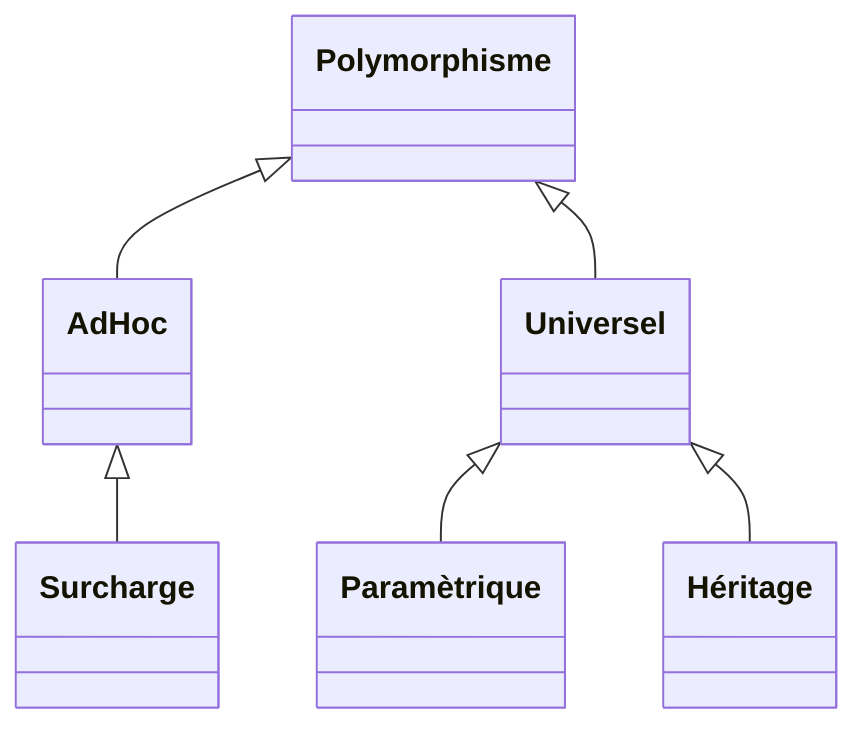

## [:house: Sommaire](../README.md)

# 8 - Polymorphisme

## :dart: Objectifs 

- Comprendre et démystifier ce terme barbare :axe:
- Distinguer les 3 types de polymorphisme
- Savoir rédéfinir des méthodes
- Créer des classes génériques

## :toolbox: Définitions et Concepts

Le polymorphisme est souvent considéré comme le troisième pilier de la programmation orientée objet, après l'encapsulation et l'héritage.

- Polymorphisme signifie ici *"qui peut prend plusieurs formes"*.
- Alors que l'héritage concerne les classes (et leur hiérarchie), le polymorphisme est principalement relatif aux méthodes.
- Comme la plupart des concepts de la programmation objet, le polymorphisme va vous permettre d'être générique pour éviter les répétition et d'avoir du code réutilisable.

- Il existe 3 types de polymorphisme : **Surcharge ou overloading**(vous connaissiez déjà sans le savoir :eyes:), **Héritage ou overriding** et **Paramètrique ou Generics**.



# Polymorphisme de Surcharge (ou Ad Hoc)

Il s'agit simplement d'avoir, dans une même classe, plusieurs méthodes ayant le **même nom et type de retour** mais des **paramètres différents, en nombre et en type**.
Exemple :
```java
class Surcharge{
	public void methode() {};
	public void methode(int a) {};
	public void methode(float f) {};
	public void methode(float f, int a) {};
	public void methode(boolean b, int a) {};
	//etc
}
```

C'est au moment de la compilation, que le ...compilateur... :eyes: , choisi la bonne méthode en analysant les types et les nombre de paramètres fournis lors de l'appel.

Regardez par exemple dans la classe String, il existe des méthodes statiques valueOf avec des types d'arguments différents pour chaque type primitif : https://docs.oracle.com/javase/8/docs/api/java/lang/String.html#valueOf-boolean-


# Polymorphisme d'Héritage

:memo: voilà enfin la solution pour éviter d'utiliser l'opérateur instanceof pour faire !

C'est ici que l'on parle de surchage de méthode ou d'overriding (Annotation @Override en java).
Il s'agit de méthodes asbtraites ou non, définies dans une classe parente, qui vont être implémentées ou réimplémentées différemment suivant les classes enfants.

```java
public abstract class ClasseMere {	
	//Méthode abstraite sans corps qui devra être obligatoirement implémentée par les enfants
	protected abstract void methodeA();
	
	//Méthode concrète dont les enfants héritent telle quelle mais qui peut être redéfinie au besoin
	public void methodeB() {
		//...
	}
	
	//Méthode concrète dont les enfants héritent telle quelle mais qui ne peut pas êter dedéfinie à cause du mot clé final
	public final void methodeC() {
		//...
	}
}
	
public class ClasseEnfant extends ClasseMere{	
	//Obligé de la redéfinir
	public void methodeA() {
	  //...		
	}

    //Annotation qui permet de voir qu'il s'agit d'une méthode redéinie et qui impose au compilateur de contrôler qu'elle à 	été définie correctement. Car si vous ommettez @Override, le compilateur ne dira rien mais si vous vous êtes trompés dans          	les paramètres votre programme plantera à l'éxécution....
    @Override
	public void methodeB() {
	    //Optionnel : Appelle la méthode définie dans le parent			
		super.methodeB();
		//Ou on implémente ce que l'on veut
		...
	}
}
```

Le cas le plus courant est la redéfinition de la méthode toString() qui hérite d'Object. En effet lorsuqe vous appellez toString() vous voyez le hashcode de votre objet (ex @5acf9800) quand vous l'affichez avec System.println(), mais si vous redéfinissez cette méthode vous pourrez afficher ce que vous voulez et bien sûr concaténer le toString d'une classe donnée avec celui de sa classe parente en récupérant son contenu avec super.toString() .

```java
public class UneClasse {	
	private int nombre;
	private String chaine;
	private boolean verite;
	
	@Override
	public String toString() {		
		return "Nombre: "+nombre+", Chaine: "+chaine+", Vérité: "+verite;
	}
}
```

## Un objet vu de façon différente grâce au casting

Au moment de l’exécution, les objets d’une classe dérivée peuvent être traités comme des objets d’une classe de base dans les paramètres de méthode et les collections ou les tableaux. Lorsque ce polymorphisme intervient, le type déclaré de l'objet n'est plus identique à son type au moment de l'exécution.

Exemple

Classe de base

```java
public abstract class Personne {

	private int age;

	public Personne(int age) {
		this.age = age;
	}

	public int getAge() {
		return age;
	}
}
```

Classes enfants

```java
public class Employe extends Personne {

	private float salaire;

	public Employe(int age, float salaire) {
		super(age);
		this.salaire = salaire;
	}

	public float getSalaire() {
		return salaire;
	}
}

public class Prestataire extends Personne {

	private float tjm;

	public Prestataire(int age, float tjm) {
		super(age);
		this.tjm = tjm;
	}

	public float getTjm() {
		return tjm;
	}
}
```

Puis dans une classe principale vous constaterez que pour placer plusieurs types différents dans la même liste on va utiliser leur type parent pour définir la liste, ici "Personne".

Puis dans une boucle sur les éléments de la liste, comme ils sont de type "Personne" à ce moment, on n'accède qu'a la méthode getAge.

Puis on vérifie avec le vilain instanceOf si ils sont de tele ou tel type, et dans ce cas on peut appliquer du casting / transtypage pour faire apparaitre les méthodes liées au type appliqué. **Notez bien les boubles parenthèses dans le casting !!!**

Dites vous que dans la mémoire l'objet contient bien tous ses attributs, le casting permet d'opérer comme un masque qui montre ou cache certains éléments sui le Type choisi pour filtrer.

```java
public class App {

	public static void main(String[] args) {
		
		List<Personne> personnes = new ArrayList<Personne>();
		personnes.add(new Employe(25, 1900f));
		personnes.add(new Prestataire(42, 2800f));
		
		for (Personne p : personnes) {
			
			System.out.println(p.getAge());
			
			if (p instanceof Employe) {
				System.out.println(((Employe)p).getSalaire());
			}
			if (p instanceof Prestataire) {
				System.out.println(((Prestataire)p).getTjm());
			}
		}
	}
}
```

# Polymorphisme Paramètrique

Supposons que l'on développe du code pour gérer une file d'attente  et que l'on veuille utiliser ce code pour :

- Une file d'entiers
- Une file de chaînes de caractères (String)
- Une file d'objets Personne
- Etc

**La première solution serait d'écrire une classe pour chaque type de valeur que l'on peut mettre dans la file**

Bof bof :thumbsdown:
- Code dupliqué = source d'erreurs
- Besoin de prévoir toutes les combinaisons possibles pour l'application

**La deuxième solution serait d'utiliser le type Object, comme toute les classes en dérivent.**

Bof Bof aussi :thumbsdown:
- obligation d'effectuer un transtypage (casting) pour accèder aux éléments de la file d'attente
- pas de contrôle sur les valeurs rangées dans la file d'attente
- code lourd, moins lisible, plus difficile à maintenir, possibles erreurs à l'éxecution

**Et bien figurez vous que la solution réside dans l'utilisation du polymorphisme paramètrique, appellé aussi généricité ou generics. Les génériques permettent de faire de l'abstraction sur les types.**

Vous vous en êtes déjà servi avec la classe ArrayList et son opérateur diamant <>. La classe ArrayList vous permet de définir le type d'objet que vous stockez dedans en le définissant à l'intérieur du diamant (new ArrayList<MonType>()).
Si vous regradez la déclaration de la classe ArrayList :

```java
public class ArrayList<E> extends AbstractList<E>
        implements List<E>, RandomAccess, Cloneable, java.io.Serializable
{
....
```

C'est la déclaration de la classe, juste après son que l'on met un lettre en majuscule entre le diamant (généralement T pour type, E pour élément, K pour clé etc).


C'est à l'éxécution que java le remplacera par le type "réél" qui a été spécifié lors de l'instanciation. Ce type T, peut être utilisé comme tous les autres type dans la classe générique où il est paramètré.

On dit que c'est un type paramètré, T dans l'exemple ci dessous qui reflète l'idée de file d'attente, est un type inconnu au moment de la compilation.

Pour l'appeller on fera un

```java
FileAttente<Personne> filePersonnes = new FileAttente<Personne>();
```

Et voici sa déclaration

```java
public class FileAttente<T>{
	private T premier;
	private T dernier;
	...
	
	public void ajouterElement(T element) {
		...
	}
}
```

Notez que l'on peut mettre plusieurs types paramètrés dans une classe !!

```java
public class Triple<T, M, Z>{
	private T truc;
	private M machin ;
	private Z zebulon ;
	...
}
```

On peut aussi exercer des contraintes pour s'assurer que type paramètré hérite bien d'une classe ou d'une interface particulière

```java
public class ExempleA<T extends UneClasse>{ ... }
public class ExempleB<T extends UneInterface>{ ... }
```

**Il n'y a pas de TP sur cet aspect dans ce chapitre, mais dans le prochain car nous y verrons une application pratique qui va nous servir en permanence avec Spring Framework, patience ...**

## :writing_hand: Travaux pratiques 

### TP1 :star: :star:

Ici on va ressortir quelques notions précédentes (constructeur, getter, setter, classe abstraite) en plus d'utiliser la redéfinition de méthode (override).

## Partie 1

A la racine de votre package principal, pour moi c'est co.simplon.poo.ch8.tp1, 

**Créez 3 classes comme suit**

- Personne
  - classe abstraite
  - attributs privés int : age, String : nom et prénom
  - constructeur manuel pour tous les arguments et getters et setters
  - redéfinition de la méthode toString() en retournant tous les champs en faisant appel à la classe StringBuilder
  - la sortie du toString doit permettre ce type d'affichage (Attention pas de System.out dans le toString()...)
  
  ```
  [co.simplon.poo.ch8.tp1.Employe] age:47 nom:Millet prenom:Stéphane
  ```

- Employe
  - Hérite de Personne
  - attribut privé : float salaire
  - constructeur manuel pour tous les arguments (plus hérités ...) et getter et setter pour salaire
  - redéfinition de toString() en rappellant le toString() du parent afin de se trouver avec çà :
  
  ```
  [co.simplon.poo.ch8.tp1.Employe] age:47 nom:Millet prenom:Stéphane salaire:10000.0
  ```

- App
  - méthode main pour faire des essais (et oui pas de tests ce coup ci !) afin de vérifier la sortie du toString
    exemple
  
  ```java
  	Employe emp = new Employe(47, "Millet", "Stéphane", 10000.f);
		System.out.println(emp);
   ```
  
## Partie 2

Créez un sous-package nommé lombok avec les 3 mêmes classes sauf que :
- les constructeurs, les getter et les setters seront générés avec Lombok
- le toString proviendra aussi de lombok en réussissant à faire appel au toString de la classe parent

Lombok n'est pas magique et des erreurs ou warning vont apparaitre sur les annotations, **il faudra bien les lire** et essayer d'en comprendre les messages. Mais sachez déjà que lombok ne sait pas dans un constructeur donné, rappeller tout seul le constructeur de la classe parente, il faut le définir soi-même et utiliser super etc. EN effet lombok découvre les types parents à l'éxécution et non à la compilation.

Voilà une liste d'annotations qui devraient vous servir, à placer au bons endroits, et dont certaines nécéssiteront des paramètres....

```java
@Data
@AllArgsConstructor
@NoArgsConstructor
@EqualsAndHashCode(...suspens...)
@ToString(...suspsens...)
```


### TP2 :star:

Ici on va utiliser la redéfinition de méthode et cet aspect du polymorhisme qui permet dans une liste de voir des objets comme leur type parent.

Comme ci-dessus pas de test unitaires, juste des vérifications dans une méthode main de la classe App.

Créez les classes comme suit :

- Animal
  - classe abstraite
  - attribut protected : String nom
  - constructeur vide et constructeur avec un paramètre
  - méthode manger qui retourne un string : nom + " mange."
  - méthode abstraite String crier
  
- Chat
  - Hérite de Animal
  - Constructeur avec un paramètre
  - Redéfinition de crier : nom + " dit Miaou!";
  - Redéfinition de manger : nom + " mange des croquettes.";

- Chien
  - Hérite de Animal
  - Constructeur avec un paramètre
  - Redéfinition de crier : nom+" dit Wouf!"  

- App avec main et comme exemple ci-dessous pour tester 

```java
List<Animal> animaux = new ArrayList<>();

		animaux.add(new Chien("Mabrouk"));
		animaux.add(new Chien("Laïka"));
		animaux.add(new Chat("Salem"));
		animaux.add(new Chat("Raven"));

		for (Animal animal : animaux) {
			System.out.println(animal.crier()+" Puis "+animal.manger());			
		}
```

doit retourner quelquechose comme çà

```
Mabrouk dit Wouf! Puis Mabrouk mange.
Laïka dit Wouf! Puis Laïka mange.
Salem dit Miaou! Puis Salem mange des croquettes.
Raven dit Miaou! Puis Raven mange des croquettes.
```

### TP3 :star: :star:

Application de Lombok, des classes abstraites, du polymorphisme d'héritage. Par contre ici on va utiliser les tests unitaires, enfin !

Créez les classes comme suit :

- CompteBancaire
  - classe abstraite
  - Lombok : @Data et @AllArgsConstructor
  - attributs protected : float taux (taux d'intêret en pourcenetage) et solde (hors intêrets, par ex montant initial versé).
  - méthode calculInteretAnnuel qui renvoie un float (montant des interet seulement)
  
- LivretA
  - Hérite de CompteBancaire
  - Lombok @Data avec les ajustements permettent de corriger les warnings (vu TP au dessus)
  
- PEL
  - Hérite de CompteBancaire
  - Lombok @Data avec les ajustements permettent de corriger les warnings (vu TP au dessus)
  
- PEA
  - Hérite de CompteBancaire
  - attribut privé float tauxImpots
  - redéfinition de la méthode calculInteretAnnuel pour permettre d'y soustraire le taux d'imposition du montant des intêrets et de renvoyer les intérets avec l'abbatement.
  - Lombok @Data avec les ajustements permettent de corriger les warnings (vu TP au dessus)

Partie Tests

Ces tests doivent passer au vert !!

```java
	@Test
	void testInteretsLivretA() {	
		assertEquals(688.5f,new LivretA(3f, 22950f).calculInteretAnnuel());		
	}
	
	@Test
	void testInteretsPEL() {			
		assertEquals(1224f,new PEL(2f, 61200f).calculInteretAnnuel());		
	}
	
	@Test
	void testInteretsPEA() {		
		assertEquals(7350f,new PEA(7f, 150000f,30).calculInteretAnnuel());
	}
```

## :speech_balloon: A retenir

- Un objet, suivant sa chaîne d'héritage, peut être vu sous plusieurs formes avec les casting
- Le polymorphisme permet d'être plus générique, simplifie la programmation en évitant de dupliquer du code.
- Il permet aussi de le rendre plus robuste grâce à des contrôles de type à la compilation et avec des contraintes sur les paramètres des types.

## :link: Recherches Web

### Site Officiel

https://docs.oracle.com/javase/tutorial/java/IandI/polymorphism.html

https://docs.oracle.com/javase/tutorial/java/generics/index.html

